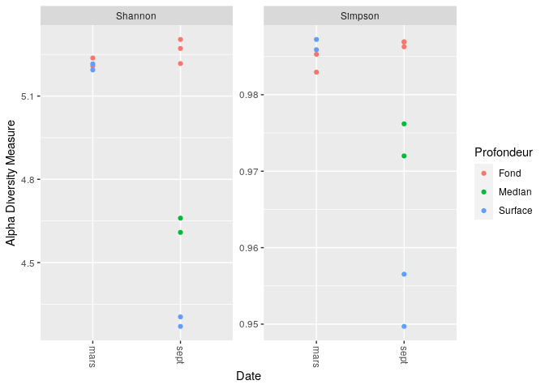
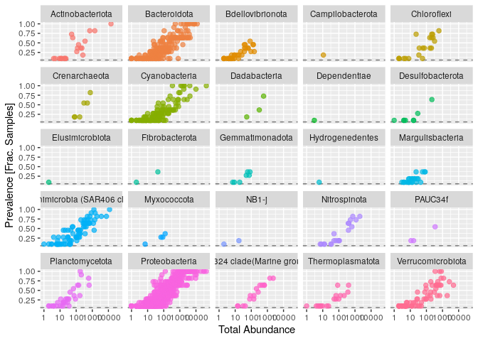
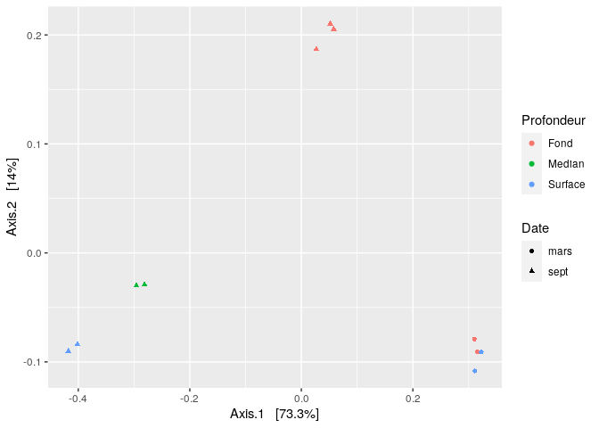
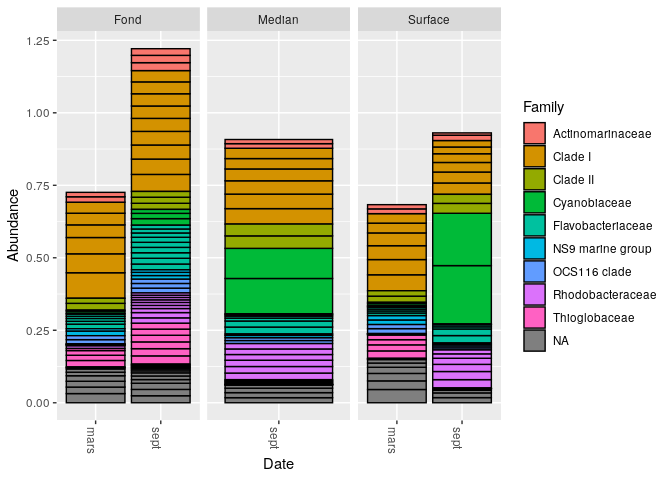
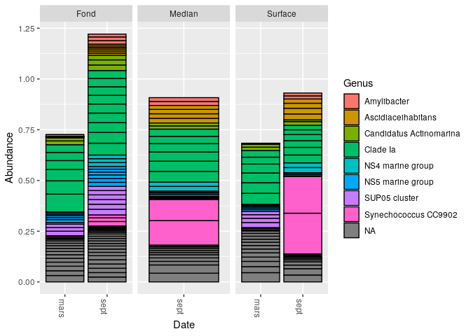
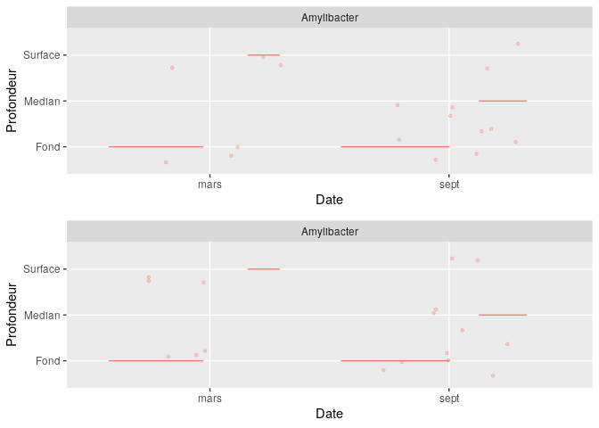
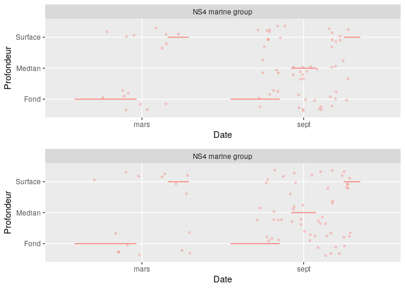
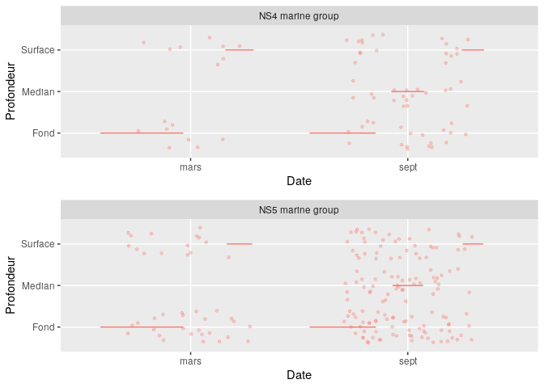
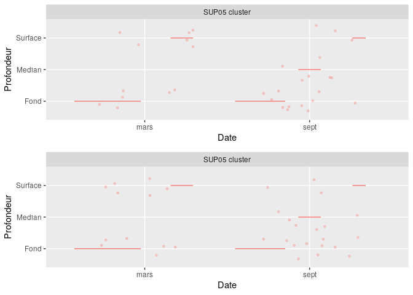
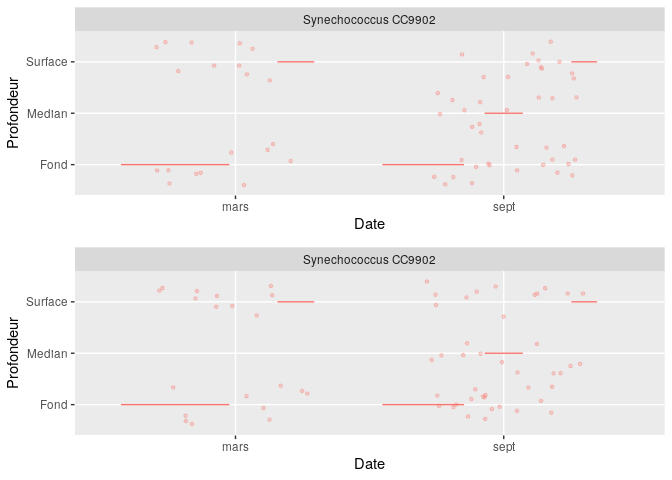

analyse phyloseq
================

  - [Création d’un fichier csv](#création-dun-fichier-csv)
  - [Visulation de la diversité
    alpha](#visulation-de-la-diversité-alpha)
  - [Filtrage taxonomique](#filtrage-taxonomique)
  - [Bar plot:](#bar-plot)
  - [Transformation de la valeur
    d’abondance](#transformation-de-la-valeur-dabondance)

Questions :

1/ quelles sont les influences relative de la profondeur et de la saison
sur la structure des communautes planctoniques de la rade de Brest

2/ Quels sont les biomarkeurs de saison (hivers et ete) ?

``` r
# Appel des library 
library(phyloseq); packageVersion("phyloseq")
```

    ## [1] '1.32.0'

``` r
library(Biostrings); packageVersion("Biostrings")
```

    ## Loading required package: BiocGenerics

    ## Loading required package: parallel

    ## 
    ## Attaching package: 'BiocGenerics'

    ## The following objects are masked from 'package:parallel':
    ## 
    ##     clusterApply, clusterApplyLB, clusterCall, clusterEvalQ,
    ##     clusterExport, clusterMap, parApply, parCapply, parLapply,
    ##     parLapplyLB, parRapply, parSapply, parSapplyLB

    ## The following objects are masked from 'package:stats':
    ## 
    ##     IQR, mad, sd, var, xtabs

    ## The following objects are masked from 'package:base':
    ## 
    ##     anyDuplicated, append, as.data.frame, basename, cbind, colnames,
    ##     dirname, do.call, duplicated, eval, evalq, Filter, Find, get, grep,
    ##     grepl, intersect, is.unsorted, lapply, Map, mapply, match, mget,
    ##     order, paste, pmax, pmax.int, pmin, pmin.int, Position, rank,
    ##     rbind, Reduce, rownames, sapply, setdiff, sort, table, tapply,
    ##     union, unique, unsplit, which, which.max, which.min

    ## Loading required package: S4Vectors

    ## Loading required package: stats4

    ## 
    ## Attaching package: 'S4Vectors'

    ## The following object is masked from 'package:base':
    ## 
    ##     expand.grid

    ## Loading required package: IRanges

    ## 
    ## Attaching package: 'IRanges'

    ## The following object is masked from 'package:phyloseq':
    ## 
    ##     distance

    ## Loading required package: XVector

    ## 
    ## Attaching package: 'Biostrings'

    ## The following object is masked from 'package:base':
    ## 
    ##     strsplit

    ## [1] '2.56.0'

``` r
library(ggplot2); packageVersion("ggplot2")
```

    ## [1] '3.3.2'

``` r
library(gridExtra); packageVersion("gridExtra")
```

    ## 
    ## Attaching package: 'gridExtra'

    ## The following object is masked from 'package:BiocGenerics':
    ## 
    ##     combine

    ## [1] '2.3'

La library permet d’activer la bibliothèque indiquée. La fonction
packageVersion permet de visualiser la version du package.

``` r
# Charge les données de DADA2 enregistré précedemment 
load("02_analyse_DADA2_FinalEnv")
```

``` r
# Construction d'un data.frame
samples.out <- rownames(seqtab.nochim)
profondeur <- sapply(strsplit(samples.out, "_"), `[`, 2)
profondeur <- gsub('.{1}$', '', profondeur)
date <- sapply(strsplit(samples.out, "_"), `[`, 3)
date <- substr(date,3,6)
samdf <- data.frame(Profondeur=profondeur, Date=date)
rownames(samdf) <- samples.out
```


``` r
# Creation d'un objet samdf
write.csv(samdf,"samdf.csv")
samdf <-read.table('~/cc2_DADA2_import/samdf.csv', sep=',', header=TRUE, row.names=1)
```

On importe les jeux de données que nous avions construir dans l’objet
samdf.

``` r
# Creation d'un objet ps 
ps <- phyloseq(otu_table(seqtab.nochim, taxa_are_rows=FALSE), 
               sample_data(samdf), 
               tax_table(taxa))
ps
```

    ## phyloseq-class experiment-level object
    ## otu_table()   OTU Table:         [ 1557 taxa and 11 samples ]
    ## sample_data() Sample Data:       [ 11 samples by 2 sample variables ]
    ## tax_table()   Taxonomy Table:    [ 1557 taxa by 6 taxonomic ranks ]

taxtab, samdf et seqtab sont regroupés dans l’objet ps. On peut voir
combien de séquences sont identifiés dans chaque échantillon. Par
exemple nous avons 1557 taxa qui sont répartis en 11 échantillons et dans
les 11 échantillons nous avons 2 variables.

# Visulation de la diversité alpha

``` r
# affichage d'un graphique de la diversité alpha 
plot_richness(ps, x="Date", measures=c("Shannon", "Simpson"), color="Profondeur",)
```

<!-- -->

La fonction estimer\_richness estime un certain nombre de mesures de la diversité alpha.


Ici nous pouvons visualiser la richesse spécifique grâce à un indice
alpha de diversité (indice de Shannone et indice de Simpson). En
abscisse nous avons les mois (Date) et en ordonné la mesure de l’alpha
diversité. On peut voir que pour la période de mars (période d’hiver),
la diversité alpha est très élevé pour la profondeur "fond" et "surface" sur les 2
indices (Shannon et Simpson). Concernant septembre, on peut voir que
l’indice alpha diversité est très élevé pour la profondeur "fond", un peu moins
pour "médian" et très faible pour "surface" pour les 2 indices. Il semblerait
donc avoir une corrélation entre date (mois), la profondeur et la
richesse.

# Filtrage taxonomique

On va créer un tableau avec le nombre de reads pour chaque phylum
présent dans l’ensemble des données.

``` r
# Afficher les rangs disponibles dans l'ensemble de données 
rank_names(ps)
```

    ## [1] "Kingdom" "Phylum"  "Class"   "Order"   "Family"  "Genus"

La fonction rank\_names permet de déterminer les rangs taxonomiques
disponibles dans un objet de classe phyloseq donné (ps).

``` r
# Créer un tableau, nombre de fonctionnalités pour chaque phyla
table(tax_table(ps)[, "Phylum"], exclude = NULL)
```

    ## 
    ##              Actinobacteriota                  Bacteroidota 
    ##                            22                           238 
    ##              Bdellovibrionota              Campilobacterota 
    ##                            35                             1 
    ##                   Chloroflexi                 Crenarchaeota 
    ##                            21                             6 
    ##                 Cyanobacteria                  Dadabacteria 
    ##                           142                             3 
    ##                  Dependentiae              Desulfobacterota 
    ##                             1                             8 
    ##               Elusimicrobiota                Fibrobacterota 
    ##                             1                             2 
    ##               Gemmatimonadota               Hydrogenedentes 
    ##                             7                             1 
    ##              Margulisbacteria Marinimicrobia (SAR406 clade) 
    ##                            24                            82 
    ##                   Myxococcota                         NB1-j 
    ##                             4                             2 
    ##                  Nitrospinota                       PAUC34f 
    ##                            20                             3 
    ##               Planctomycetota                Proteobacteria 
    ##                            32                           786 
    ##  SAR324 clade(Marine group B)              Thermoplasmatota 
    ##                            16                            18 
    ##             Verrucomicrobiota                          <NA> 
    ##                            71                            11

La fonction tax\_table permet de créer un tableau avec le nombre
d’occurence pour chaque phyla de notre jeu de données.

Proteobacteria a 786 occurence (le plus abondant) , Bacteroidota a 238
occurence et Cyanobacteria a 142 occurence.

Les NA sont probablement des artefacts et doivent être supprimées. Les
fonctionnalités avec une annotation de phylum ambigue sont également
supprimées.

``` r
ps <- subset_taxa(ps, !is.na(Phylum) & !Phylum %in% c("", "uncharacterized"))
```

Ici on sous échantillonne la table ps grâce à la fonction subset\_taxa
en appliquant 2 conditions : on retire les phylum NA et les phylum
uncharacterized.

``` r
# Compute prevalence of each feature, store as data.frame
prevdf = apply(X = otu_table(ps),
               MARGIN = ifelse(taxa_are_rows(ps), yes = 1, no = 2),
               FUN = function(x){sum(x > 0)})
# Add taxonomy and total read counts to this data.frame
prevdf = data.frame(Prevalence = prevdf,
                    TotalAbundance = taxa_sums(ps),
                    tax_table(ps))
```

Ceci permet de faire la prévalence des taxa et un filtrage (le nombre
d’echantillons dans lesquel un taxa apparait au moins une fois) qui
sera ensuite enregistré dans le data.frame. Puis on ajoute le nombre
total de read et l’annotation taxonomique à data.frame

``` r
# Calculez les prévalences totales et moyennes des caractéristiques dans chaque phylum.
plyr::ddply(prevdf, "Phylum", function(df1){cbind(mean(df1$Prevalence),sum(df1$Prevalence))})
```

    ##                           Phylum        1    2
    ## 1               Actinobacteriota 3.727273   82
    ## 2                   Bacteroidota 3.978992  947
    ## 3               Bdellovibrionota 2.342857   82
    ## 4               Campilobacterota 2.000000    2
    ## 5                    Chloroflexi 4.238095   89
    ## 6                  Crenarchaeota 4.500000   27
    ## 7                  Cyanobacteria 3.204225  455
    ## 8                   Dadabacteria 4.666667   14
    ## 9                   Dependentiae 1.000000    1
    ## 10              Desulfobacterota 2.000000   16
    ## 11               Elusimicrobiota 1.000000    1
    ## 12                Fibrobacterota 2.500000    5
    ## 13               Gemmatimonadota 2.428571   17
    ## 14               Hydrogenedentes 1.000000    1
    ## 15              Margulisbacteria 1.833333   44
    ## 16 Marinimicrobia (SAR406 clade) 4.414634  362
    ## 17                   Myxococcota 2.750000   11
    ## 18                         NB1-j 1.500000    3
    ## 19                  Nitrospinota 3.950000   79
    ## 20                       PAUC34f 3.333333   10
    ## 21               Planctomycetota 3.437500  110
    ## 22                Proteobacteria 4.296438 3377
    ## 23  SAR324 clade(Marine group B) 4.687500   75
    ## 24              Thermoplasmatota 2.722222   49
    ## 25             Verrucomicrobiota 3.788732  269

Ici on peut regarder la prévalence des phylas. On retrouve les mêmes
résultats : Proteobacteria, Bacteroidota et Cyanobacteria sont les
phyla les plus abondants.

``` r
# Subset to the remaining phyla
prevdf1 = subset(prevdf, Phylum %in% get_taxa_unique(ps, "Phylum"))
ggplot(prevdf1, aes(TotalAbundance, Prevalence / nsamples(ps),color=Phylum)) +
  # Include a guess for parameter
  geom_hline(yintercept = 0.05, alpha = 0.5, linetype = 2) +  geom_point(size = 2, alpha = 0.7) +
  scale_x_log10() +  xlab("Total Abundance") + ylab("Prevalence [Frac. Samples]") +
  facet_wrap(~Phylum) + theme(legend.position="none")
```

<!-- -->

la fonction facer\_wrap permet de faire plusieurs graphiques. Ce graphe
represente donc la prévalence en fonction de l’abondance total pour
chaque phyla. Les points correspondent a un taxon différent. On peut
voir ici que les Proteobacteria, les Bacteroidota ainsi que les
Cyanobacteria ont une abondance relativement importante.

``` r
pslog <- transform_sample_counts(ps, function(x) log(1 + x))
out.wuf.log <- ordinate(pslog, method = "PCoA", distance = "bray")
```

La fonction transform\_sample\_counts permet de transformer les données
d’abondance en une OTU\_table. On va construire une PCoA en utilisant la
distance bray-Curtis afin d’évaluer la dissimilarité entre les taxons.

``` r
evals <- out.wuf.log$values$Eigenvalues
plot_ordination(pslog, out.wuf.log, color = "Profondeur", shape="Date") +
  labs(col = "Profondeur",shape= "Date")
```

<!-- -->

Ce graphique est une PCoA (suivant une distance de Bray-Curtis). Les
ronds representent le mois de mars et les triangles representent le mois
de septembre. Les différentes couleurs representent les niveaux de
profondeurs (fond, médian, surface). Les axes correspondent aux variances
c’est à dire à la distribution de la communauté microbienne dans les
échantillons.

Pour l’axe 1, nous avons des triangles (le mois de septembre) qui sont
regroupés entre eux et les ronds (le mois de mars) qui sont regroupé
entre eux également mais qui sont éloignés du mois de septembre. L’axe 1
nous montre donc la distribution de la communauté microbienne en
fonction des saisons. Pour l’axe 2 nous pouvons voir la distribution de
la communauté microbienne en fonction de la profondeur (pour le mois de
septembre). Par exemple, les échantillons proches de la surface sont
regroupé entre eux et éloigné par rapport aux échantillons médian et les
échantillons du fond.

Nous n'avons donc pas les mêmes communautés microbiennes en fonction des
saisons et au sein d’une même saisons (ici septembre) nous avons pas la
même structure de la communauté microbienne en fonction des profondeurs.
La profondeur a également un impacte mais il est moins important par
rapport aux saisons.

# Bar plot:

``` r
top20 <- names(sort(taxa_sums(ps), decreasing=TRUE))[1:20]
ps.top20 <- transform_sample_counts(ps, function(OTU) OTU/sum(OTU))
ps.top20 <- prune_taxa(top20, ps.top20)
plot_bar(ps.top20, x="Date", fill="Family") + facet_wrap(~Profondeur, scales="free_x")
```

<!-- -->

On réalise un diagramme en batonnet dans lequel on prend les 20
premières séquences. En ordonné nous avons les abondances pour chaque
profondeur (surface, fond et médian) et en abscisse nous avons le mois
(mars ou septembre). Les différentes couleurs correspondent aux familles.

Si nous comparons l’abondance des communautés microbienne entre le mois
de mars et le mois de septembre, on peut voir que l’abondance du mois de
mars est toujours plus faible par rapport au mois de septembre. On
remarque également qu’il n y a pas de différence d’abondance entre les
échantillons de fond et de surface pour le mois de mars. Cependant pour
le mois de septembre on peut voir que l’abondance est plus élevée pour
les échantillons du fond que pour les échantillons médian et surface.

On peut voir que le clade I (orange/jaune) correspond a la famille qui
est prédominante pour toutes les profondeurs et pour le mois de mars et
le mois de septembre. Les Cyanobiaceae est aussi une famille qui
prédomine mais seulement pour le mois de septembre pour des profondeurs
médian et surface.

Donc la saisons et la profondeur va avoir un imapct sur la diversité,
l’abondance et sur la structure des communautés microbienne.

``` r
top20 <- names(sort(taxa_sums(ps), decreasing=TRUE))[1:20]
ps.top20 <- transform_sample_counts(ps, function(OTU) OTU/sum(OTU))
ps.top20 <- prune_taxa(top20, ps.top20)
plot_bar(ps.top20, x="Date", fill="Genus") + facet_wrap(~Profondeur, scales="free_x")
```

<!-- -->

On refait la même chose mais cette fois avec le genre.

On peut voir que l’abondance de la communauté microbienne en mars est
faible par rapport a l’abondance en septembre pour chaque profondeur. On
remarque également qu’il n y a pas de différence d’abondance entre les
échantillons de fond et de surface pour le mois de mars. Cependant pour
le mois de septembre on peut voir que l’abondance est plus élevée pour
les échantillons du fond que pour les échantillons médian et surface.

Le clade Ia est le genre qui prédomine le plus dans toutes les
conditions (mois et profondeur), sauf dans la condition septembre en
surface. Le Synechococcus CC9902 est également un genre très prédominant
mais que dans la condition septembre en profondeur surface.

Les saisons et les profondeurs vont donc avoir des influences sur les
communautés microbiennes (diversité, abondance et structure).

D’après ces résltats il semblerai que pour le mois de septembre on
retrouve spécifiquement : Synechococcus CC9902, NS4\_marine\_groupe.

SUP05 cluster, NS5\_marine\_groupe et Amylibacter sont a la fois present dans le mois de mars (en plus faible abondance) et dans le mois de septembre.

# Transformation de la valeur d’abondance

``` r
plot_abundance = function(physeq,title = "",
Facet = "Genus", Color = "Genus"){
# Arbitrary subset, based on Phylum, for plotting
p1f = subset_taxa(physeq, Genus %in% c("Amylibacter"))
mphyseq = psmelt(p1f)
mphyseq <- subset(mphyseq, Abundance > 0)
ggplot(data = mphyseq, mapping = aes_string(x = "Date",y = "Profondeur",
color = Color, fill = Color)) +
geom_violin(fill = NA) +
geom_point(size = 1, alpha = 0.3,
position = position_jitter(width = 0.3)) +
facet_wrap(facets = Facet) + theme(legend.position="none")}
```

la fonction plot\_abundance permet de définir un graphique d’abondance
relative.

``` r
ps3rj = transform_sample_counts(ps, function(x){x / sum(x)})
```

On convertit les comptages de chaque échantillon en leurs fréquences
appelées proportions ou abondances relatives grâce à la fonction
transform\_sample\_counts Maintenant on va tracer les valeurs
d’abondances avant et après la transformation.

``` r
plotBefore = plot_abundance(ps,"")
plotAfter = plot_abundance(ps3rj,"")
grid.arrange(nrow = 2, plotBefore, plotAfter)
```

<!-- -->

Le premier graphique correspond aux abondances avant la transformation
(ps) et le 2ème graphique correspond aux abondances après transformation
(ps3rj)

En ordonnée nous avons la profondeur (surface, median et fond) et en
abscisse nous avons la date (mars ou sept). Ce graphique on regarde la
répartition de Amylibacter en fonction de la profondeur et des dates.

On retrouve Amylibacter au mois de mars et au mois de septembre avec des abondances a peu près similaires. Ce
n’est donc pas un très bon biomarqueur car il a la fois en mars et en
septembre.

``` r
plot_abundance = function(physeq,title = "",
Facet = "Genus", Color = "Genus"){
# Arbitrary subset, based on Phylum, for plotting
p1f = subset_taxa(physeq, Genus %in% c("NS4 marine group"))
mphyseq = psmelt(p1f)
mphyseq <- subset(mphyseq, Abundance > 0)
ggplot(data = mphyseq, mapping = aes_string(x = "Date",y = "Profondeur",
color = Color, fill = Color)) +
geom_violin(fill = NA) +
geom_point(size = 1, alpha = 0.3,
position = position_jitter(width = 0.3)) +
facet_wrap(facets = Facet) + theme(legend.position="none")}
```

``` r
ps3rd = transform_sample_counts(ps, function(x){x / sum(x)})
```

``` r
plotBefore = plot_abundance(ps,"")
plotAfter = plot_abundance(ps3rd,"")
grid.arrange(nrow = 2, plotBefore, plotAfter)
```

<!-- -->

Ici on a fait la même chose. On peut voir que NS4 marine group est
retrouvé en mars et en septembre. On remarque qu’il y à une plus grande
abondance de NSA marine group pour le mois de septembre par rapport au
mois de mars. Ce n’est donc pas un très bon biomarqueur car on le
retrouve quand même pour le mois de mars.

``` r
plot_abundance = function(physeq,title = "",
Facet = "Genus", Color = "Genus"){
# Arbitrary subset, based on Phylum, for plotting
p1f = subset_taxa(physeq, Genus %in% c("NS5 marine group"))
mphyseq = psmelt(p1f)
mphyseq <- subset(mphyseq, Abundance > 0)
ggplot(data = mphyseq, mapping = aes_string(x = "Date",y = "Profondeur",
color = Color, fill = Color)) +
geom_violin(fill = NA) +
geom_point(size = 1, alpha = 0.3,
position = position_jitter(width = 0.3)) +
facet_wrap(facets = Facet) + theme(legend.position="none")}
```

``` r
ps3re = transform_sample_counts(ps, function(x){x / sum(x)})
```

``` r
lotBefore = plot_abundance(ps,"")
plotAfter = plot_abundance(ps3re,"")
grid.arrange(nrow = 2, plotBefore, plotAfter)
```

<!-- -->

Ici on a fait la même chose et on observe la même chose. NS5 marine
group est retrouvé en mars et en septembre avec une abondance plus
importante pour le mois de septembre. Ce n’est donc pas un très bon
biomarqueur.

``` r
plot_abundance = function(physeq,title = "",
Facet = "Genus", Color = "Genus"){
p1f = subset_taxa(physeq, Genus %in% c("SUP05 cluster"))
mphyseq = psmelt(p1f)
mphyseq <- subset(mphyseq, Abundance > 0)
ggplot(data = mphyseq, mapping = aes_string(x = "Date",y = "Profondeur",
color = Color, fill = Color)) +
geom_violin(fill = NA) +
geom_point(size = 1, alpha = 0.3,
position = position_jitter(width = 0.3)) +
facet_wrap(facets = Facet) + theme(legend.position="none")}
```

``` r
ps3rd = transform_sample_counts(ps, function(x){x / sum(x)})
```

``` r
plotBefore = plot_abundance(ps,"")
plotAfter = plot_abundance(ps3rd,"")
grid.arrange(nrow = 2, plotBefore, plotAfter)
```

<!-- -->

Ici on a fait la même chose et on observe la même chose. SUP05 cluster
est retrouvé en mars et en septembre avec une abondance plus importante
pour le mois de septembre. Ce n’est donc pas un très bon biomarqueur.

``` r
plot_abundance = function(physeq,title = "",
Facet = "Genus", Color = "Genus"){
# Arbitrary subset, based on Phylum, for plotting
p1f = subset_taxa(physeq, Genus %in% c("Synechococcus CC9902"))
mphyseq = psmelt(p1f)
mphyseq <- subset(mphyseq, Abundance > 0)
ggplot(data = mphyseq, mapping = aes_string(x = "Date",y = "Profondeur",
color = Color, fill = Color)) +
geom_violin(fill = NA) +
geom_point(size = 1, alpha = 0.3,
position = position_jitter(width = 0.3)) +
facet_wrap(facets = Facet) + theme(legend.position="none")}
```

``` r
ps3rf = transform_sample_counts(ps, function(x){x / sum(x)})
```

``` r
plotBefore = plot_abundance(ps,"")
plotAfter = plot_abundance(ps3rf,"")
grid.arrange(nrow = 2, plotBefore, plotAfter)
```

<!-- -->

Ici on a fait la même chose. Synechococcus CC9902 est retrouvé en mars
et en septembre. On remarque qu’il y a une plus grande abondance de
Synechococcus CC9902 pour le mois de septembre par rapport au mois de
mars.

Ces résultats sont plutôt très étonnants car avec les diplots on pouvait
clairement voir que synechoccocus CC9902 était très abondant pour le mois
de septembre et était principalement retrouvé que pendant le mois de
septembre. On pouvait donc dire à partir de ces analyses que
Synechococcus CC990 pouvait être utilisé comme biomarqueur pour les
saisons d’été mais seulement pour des profondeurs de surface et médian.

Cependant avec ces dernières analyses on observe que Synechococcus
CC9902 est également présent pour le mois de mars et de septembre mais
avec une abondance beaucoup plus importante pour le mois de septembre.

Synechococcus CC9902, NS4\_marine\_group et NS5\_marine\_group peuvent
être utilisés comme biomarqueurs mais ils ne sont pas très précis, la
seule difference qu’on peut observer entre les mois de mars et septembre
ce sont les abondances qui sont beaucoup plus importants pour le mois de
septembre.

Concernant le mois d’hiver, on ne peut pas déterminer de biomarqueur,
car les genres retrouvés pour le mois de mars sont également retrouvés
dans le mois de septembre.
